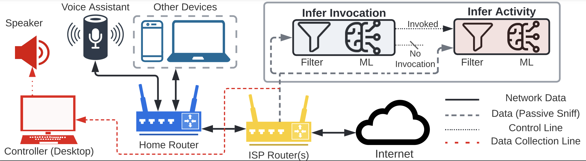

# Spying through your voice assistants: Realistic voice command fingerprinting


# Introduction

This repo contains the code for the paper titled "**Spying through your voice assistants: Realistic voice command fingerprinting**" set to appear in *USENIX Security 2023*. 

This README file contains instructions to setup and use our system for a remote Voice Command inference attack on encrypted network traffic.

Please consider citing our paper if you use any part of this repo in your project

{Citation will be added shortly}

# Environment Setup

The instructions to setting up the environment for analysis can be found in the [setup/README.md](setup/README.md) file. The instructions to setup for collecting your own data can be found in the [src/collection/README.md](src/collection/README.md) file.

# Datasets

The instructions on how to setup the datasets and access the are provided in the [data/README.md](data/README.md) file. Refer to the instructions in that file to setup the datasets correctly. You would need the datasets to run/test [The Fingerprinting Process](#the-fingerprinting-process-offline)

# Data Collection

You can also collect your own data for training, evaluating or optimizing models. However you will need additional hardware such as routers and voice assistant based devices (e.g smart speakers). You will also need the technical knowledge to setup these devices correctly and solve any network connection issues they might face. All the files required for collection are provided in the `src/collection` directory. You can also find details on how to setup the collection hardware and software environment in the [src/collection/README.md](src/collection/README.md) file


# The Fingerprinting Process (Offline)

The following commands describe the process of fingerprinting voice commands in an offline fashion i.e training ML models or evaluation ML models given the data in PCAP format is available. For the "live" fingerprinting demo refer to the next section "Live Demo Setup".

Before running any commands ensure you have setup the [Environment](#environment-setup) correctly and also downloaded and placed the [Datasets](#datasets) correctly.

The options for all scripts provided can be seen by passing the `--help` or `-h` keyword to the script e.g

```sh
$ python3 src/scripts/PCAP2CSV.py -h
```

## Converting to CSV format
### 1. Change working directory to 'va-fingerprinting' directory

Run the following command with `path/to/va-fingerprinting` changed to the path you setup the code at

```sh
$ cd path/to/va-fingerprinting
```

### 2. Converting data from PCAP files to CSV and creating the DNS mapping

The following commands uses the tshark and python script to convert the network capture from PCAP to CSV dropping extra columns and performing preliminary processing of data. This step also creates and DNS mapping from passive DNS. Replace the `data/{dataset}` with the correct dataset path (e.g `data/simple_50_google`)

```sh
$ python3 src/scripts/PCAP2CSV.py -i data/{dataset}
```

## Invocation-Detection

Invocation detection refers to detecting when a voice assistant was activated. To do this we first create sliding windows over the data. Sliding windows are a width of 4 seconds and slide 2 seconds on each iteration (so a 2 second overlap exists in each window).

### 1. Creating sliding windows over the dataset

To create the sliding windows over the data use the following command. This script iterates over the CSV data processing it and creating windows. The script also saves the data in the `data/{dataset}/invocation-detection` directory. The subdirectory name depends on the configuration used to create the data e.g window size, slide size etc.

```sh
$ python3 src/scripts/InvocationDetection.py windows -i data/{dataset}
```


### 2. Extracting features and training the models

After the sliding windows are created we can then load the sliding windows and create a balanced dataset to then extract features from it and train the machine learning models. By default many different models are trained. In our paper, we presented the results of all models but used RandomForest for further evaluations.

```sh
$ python3 src/scripts/InvocationDetection.py train -i data/{dataset}
```

The results will be broken down by model and shown on the terminal stdout. The models will also be saved in the dataset directory.

### 3. (Optional) Inferring using the ML Model

To infer using a trained ML model on a different dataset the following command can be used with appropriate paths set

```console
$ python3 src/scripts/InvocationDetection.py infer -mi data/{train_dataset} -i data/{test_dataset}
```

## Activity-Detection

Activity detection refers to detecting the voice command, skill or the streaming service being used on the voice assistant. We follow similar setup as invocation detection in terms of scripts where one script creates the required files. A second one extracts the features. Finally we have scripts for training the ML models and inferring on another dataset using a trained model

### 1. Creating windows (chunks of traffic) for each activity

Since our captured data is continous and needs to be chunked based on the invoke records we use the following scripts to use the CSV files and create a per command/event CSV file to then extract features from.

```sh
$ python3 src/scripts/ActivityDetection.py windows -i data/{dataset}
```

### 2. Extracting features from these windows
After the CSV files are create we can use the following commands to extract features from them.

```sh
$ python3 src/scripts/ActivityDetection.py features -i data/{dataset}
```

### 3. Training the ML Models

We train different models and also use the AutoGluon library which itself trains and optimizes multiple models. In our paper we only report the numbers from the AutoGluon models. Use the following commands to train the models

```sh
$ python3 src/scripts/ActivityDetection.py train -i data/{dataset}
```

The results will be displayed at the terminal after the script is done running.

### 4. (Optional) Inferring the trained model on another dataset

To evaluate performance on a different dataset than the one trained on use the following commands. Replace `{train_dataset}` with the dataset that you previously trained the models for and the `{test_dataset}` with the dataset that you want to evaluate one.

```sh
$ python3 src/scripts/ActivityDetection.py infer -mi data/{train_dataset} -i data/{test_dataset}
```

# Post-processing (tables)

To compute the Activity Detection table and Invocation Detection table across the datasets we have provided a post processing script. 

To compute the Invocation Detection table run the following commands (Note the path is now to base data directory instead to the dataset)

```sh
$ python3 src/scripts/PostProcessing.py id-table -d data/
```

This script will scan all the dataset directories and whichever has the results pre computed will be added to the table that will be provided. To save the tabel pass the `-o` flag with the path to save the table in.

Similarly to compute the Activity Detection table run the following command.

```sh
$ python3 src/scripts/PostProcessing.py ad-table -d data/
```
